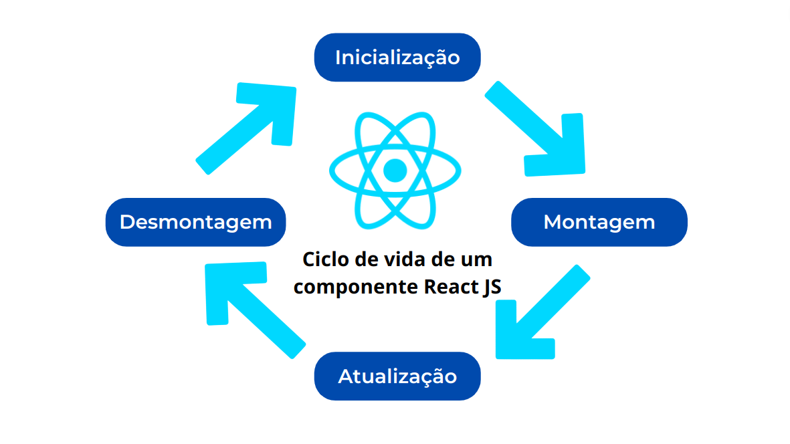

# Error Boundaries
### React

---

## Componente

```javascript
function MeuComponente() {
  return (
    <div>
      <h1>Meu Componente</h1>
      <p>Parágrafo de meu componente.</p>
    </div>
  );
}

export default MeuComponente;
```

---
## Ciclo de Vida



---

## Vai dar certo!


---


### E agora?


---
### "Um erro de JavaScript em uma parte da interface do usuário não deve quebrar toda a aplicação"

---
## Error Boundaries

* Introduzidos na v16, os error boundaries são componentes que capturaram e lidam com os erros durante o processo de renderização, exibindo uma interface de fallback ao invés de quebrar toda a aplicação. 
---


###### - Error boundaries são componentes React que capturam erros de JavaScript em qualquer lugar em sua árvore de componentes filho, **registram** esses erros e exibem uma **UI substituta** em vez da árvore de componentes que travou. 
###### - Detectam erros durante a fase renderização, nos métodos do ciclo de vida e nos construtores de toda a árvore abaixo deles.
###### - Apresentam algumas limitações: renderização server side, erros em códigos assíncronos [setTimeOut( )], manipuladores de eventos [onClick()] e erros internos no error boundary. 


---

## Exemplo


---


---
## Como instalar
```javascript
import { ErrorBoundary } from 'react-error-boundary'
import './App.css'

const Counter = (props: any) => {
  return <h1>
    O total da contagem é {props.counter.toFixed(2)}
  </h1>
}
// UI alternativa
const ErrorHandler = () => {
  return <>
    <h2>Opa, ocorreu um erro, meu patrão </h2>
    <h3>Mas tudo certo, já estamos resolvendo para você!</h3>
  </>
}

function notifyError () {
  // Podemos chamar uma api para notificar que um erro aconteceu
}

// Uso o ErrorBoundary, aponto o componente Fallback e uso o onError para comunicar o erro ocorrido.
function App() {
  return (
    <ErrorBoundary FallbackComponent={ErrorHandler} onError={(arg1, arg2)=>{
      console.log("arg1",arg1,"arg2",arg2)
    }}>
      <div className='App'>
        <Counter />
      </div>
    </ErrorBoundary>
  )
}

export default App
```
---
## Portanto


###### getDerivedStateFromError: Atualiza o estado do componente **para que** uma UI de fallback possa ser renderizada. É chamado durante a fase de renderização.
###### componentDidCatch: Executa ações secundárias **após** o estado ter sido atualizado. É chamado depois que o componente foi renderizado novamente com a UI de fallback.

---
## Obrigado!

###### https://br.linkedin.com/in/davi-portela  | https://github.com/daviport
